# Дипломный проект курса «React»

Дипломный проект представляет собой интернет-магазин обуви. Задача заключается в создании работающего приложения, всеми основными функциями которого можно пользоваться.

Как это всегда бывает, вы (фронтенд разработчик) - последний в цепочке создания продукта, поэтому вам необходимо пользоваться результатами работы верстальщика и бекэнд разработчика. И если результаты работы верстальщика вы ещё можете немного подправить, то бэкенд - уже нет (т.е. вы не имеете права редактировать бэкенд).

Большая часть разметки и стилей уже реализована за вас и хранится в каталоге `html`. Как всегда, пояснений особо к разметке нет, т.к. со слов верстальщика "там и так всё понятно".

Перейдём к самому приложению.

## Обязательные условия

Все функции должны быть реализованы.

Внешний вид должен быть аналогичен тому, что представлен в разметке (каталог `html`).

Бэкенд видоизменять нельзя. Всё, что можно там сделать, это раскомментировать строки для генерации задержки и ошибки:
```js
const fortune = (ctx, body = null, status = 200) => {
    // Uncomment for delay
    // const delay = randomNumber(1, 10) * 1000;
    const delay = 0;
    return new Promise((resolve, reject) => {
        setTimeout(() => {
            // Uncomment for error generation
            // if (Math.random() > 0.8) {
            //     reject(new Error('Something bad happened'));
            //     return;
            // }

            ctx.response.status = status;
            ctx.response.body = body;
            resolve();
        }, delay);
    })
}
```

Они специально закомментированы, чтобы вам не приходилось ждать по 0-10 секунд на каждый запрос и не мучаться с ошибками.

Запускать сервер нужно командой `npm run watch` (не забудьте сначала сделать `npm install`) - тогда он запустится в режиме live-reload. Если есть к нему вопросы - пишите в Slack или в группу Fb.

Для хранения состояния корзины и побочных эффектов могут использоваться:
1. Context API + побочные эффекты в компонентах
1. Redux + побочные эффекты в компонентах, либо Action Creator'ах
1. Redux + Redux Thunk
1. Redux + Redux Observable
1. Redux + Redux Saga

Выбирайте любой удобный вам способ. Итоговая оценка не зависит от того, какой из 5-ти способов вы выберите.

Весь код должен быть выложен на GitHub в виде отдельного репозитория.

При оформлении кода рекомендуем вам опираться на стиль кодирования Airbnb: https://github.com/airbnb/javascript (именно JS, а не React).

Можете ознакомиться с [методическими рекомендациями по оценке диплома](./guidelines.md), в соответствии с которыми дипломные руководители будут оценивать ваш диплом.

Важно: не забывайте показывать Loader при загрузке и сообщение об ошибке, если с сервера вы её получили (или вообще ничего не получили, например, у пользователя сейчас нет интернет-соединения).

## Вехи

На весь диплом даётся три недели, в соответствии с чем, мы выделили ключевые вехи, которые отражают, какая часть и до какого срока должна быть сдана (вы можете делать и быстрее, но не медленнее)

1. Первая неделя:
    - Постраничный роутинг
    - Шапка и футер
    - Статичные страницы (404, О Магазине, Контакты)
    - Баннер
2. Вторая неделя:
    - Работа с HTTP (без отображения Loader/обработки ошибок)
    - Компонент "Хиты продаж"
    - Каталог (компонент на главной странице и на странице каталога)
    - Поиск
    - Для тех, кто работает с Redux - подключение Redux
3. Третья неделя:
    - Глобальное состояние (как минимум, для корзины)
    - Корзина и оформление заказа
    - Loader/обработка ошибок

Не забывайте выделить время на исправление замечаний от дипломных руководителей!

## Содержание

Приложение содержит следующие самостоятельные экраны (страницы):

1. Главная страница
1. Каталог товаров
1. Информационная страница
1. Страница товара
1. Корзина
1. 404

## Переходы между экранами

Навигационным центром приложения являются шапка и футер каждого экрана (страницы):

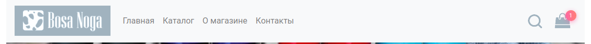

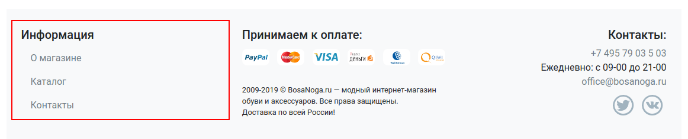

Из шапки можно попасть на следующие экраны:
* Логотип и ссылка "Главная" - ведут на главную страницу, URL - "/"
* Каталог - ведёт на страницу каталога, URL - "/catalog.html"
* О магазине - ведёт на страницу "О магазине", URL - "/about.html"
* Контакты - ведёт на страницу "Контакты", URL - "/contacts.html"

Из футера можно попасть на следующие экраны:
* О магазине - ведёт на страницу "О магазине", URL - "/about.html"
* Каталог - ведёт на страницу каталога, URL - "/catalog.html"
* Контакты - ведёт на страницу "Контакты", URL - "/contacts.html"

## Описание экранов

### Главная страница

Экран «Главная страница» доступен по умолчанию при открытии приложения.

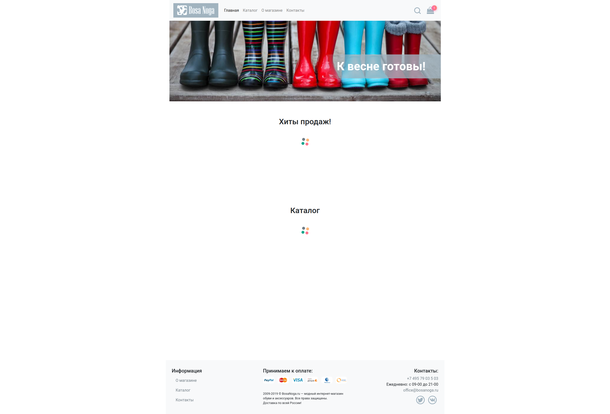

При загрузке любых данных с помощью сетевых запросов должен отображаться лоадер. У каждого "виджета" лоадер свой (т.е. у вас не должно быть одного лоадера на всё приложение).

После загрузки страница выглядит следующим образом:

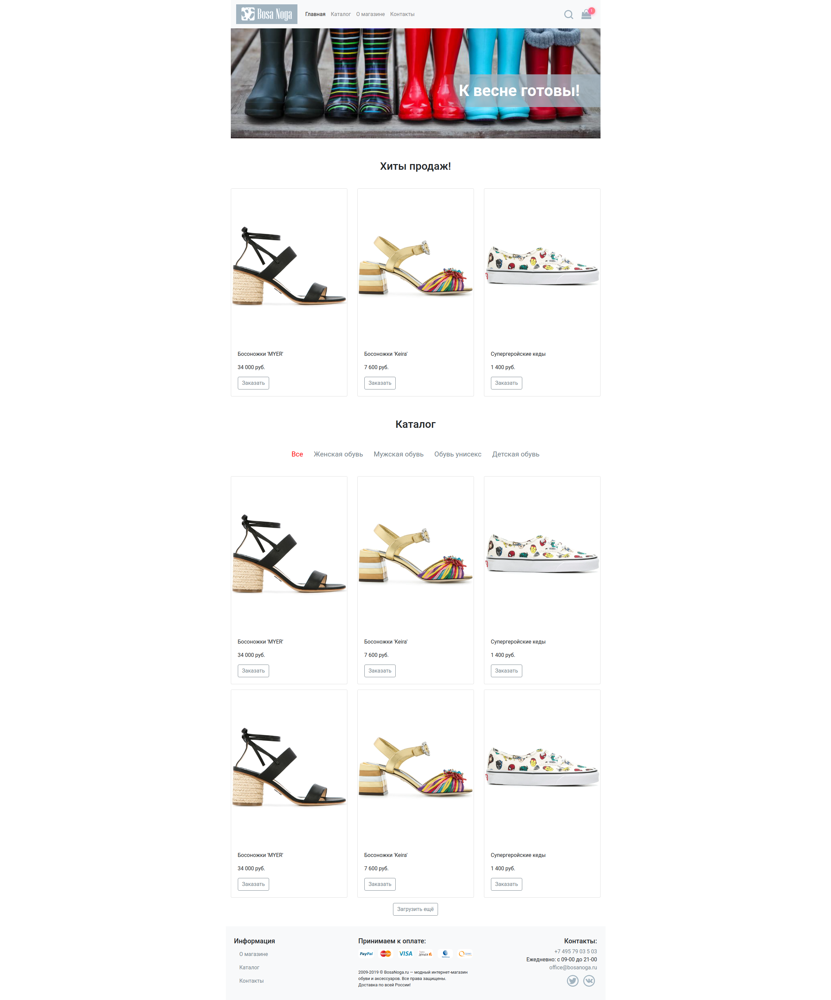

Общая схема:

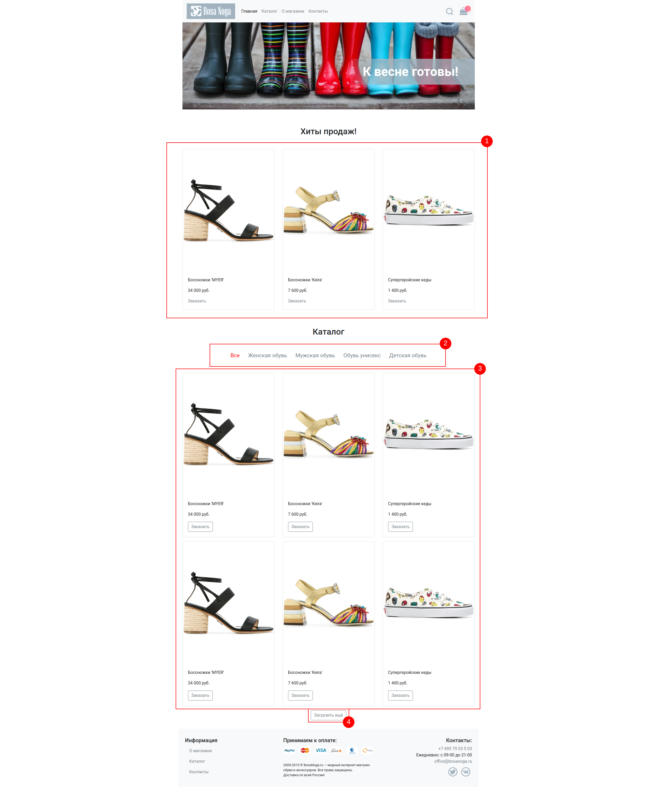

Вам нужно реализовать:

1. Хиты продаж - GET http://localhost:7070/api/top-sales. В ответ приходит JSON, содержащий данные. Вам необходимо его распарсить и вывести элементы. Если в ответе пришёл пустой массив (т.е. хитов продаж нет), то компонент не должен ничего отображать (как и не должен занимать места на экране).

1. Категории каталога - GET http://localhost:7070/api/categories. В ответ приходит массив категорий без элемента "Все" (его вы должны добавить сами). По умолчанию выбранный элемент служит для определения того, какие будут загружаться товары из каталога (т.е. "Все" - загружаются все, "Женская обувь" - загружается только женская обувь). Активный элемент выделен. При смене категории делается новый запрос, предыдущие загруженные данные удаляются.

1. Элементы каталога - GET http://localhost:7070/api/items (для варианта "Все"). При другой выбранной категории, вы делаете запрос вида GET http://localhost:7070/api/items?categoryId=X. Возвращается массив элементов, соответствующих вашему запросу.

1. Загрузить ещё - при запросе элементов каталога загружаются следующие 6. При нажатии на "Загрузить ещё" загружаются ещё 6: GET http://localhost:7070/api/items?offset=6 (где `offset` определяет сколько элементов пропустить). Если сервер вернул пустой массив или меньше 6 элементов, то кнопка "Загрузить ещё" должна исчезнуть. На время загрузки над кнопкой так же показывается лоадер, сама кнопка отключается.

Обратите внимание, при загрузке по кнопке ещё должна учитываться выбранная категория: т.е. выбрана категория Женская обувь, то при нажатии на ещё делается запрос GET http://localhost:7070/api/items?categoryId=X&offset=6 (и т.д.)


Рекламный баннер и текст на нём являются статичными.

### Каталог товаров

Экран «Каталог товаров» должен выглядеть следующим образом:

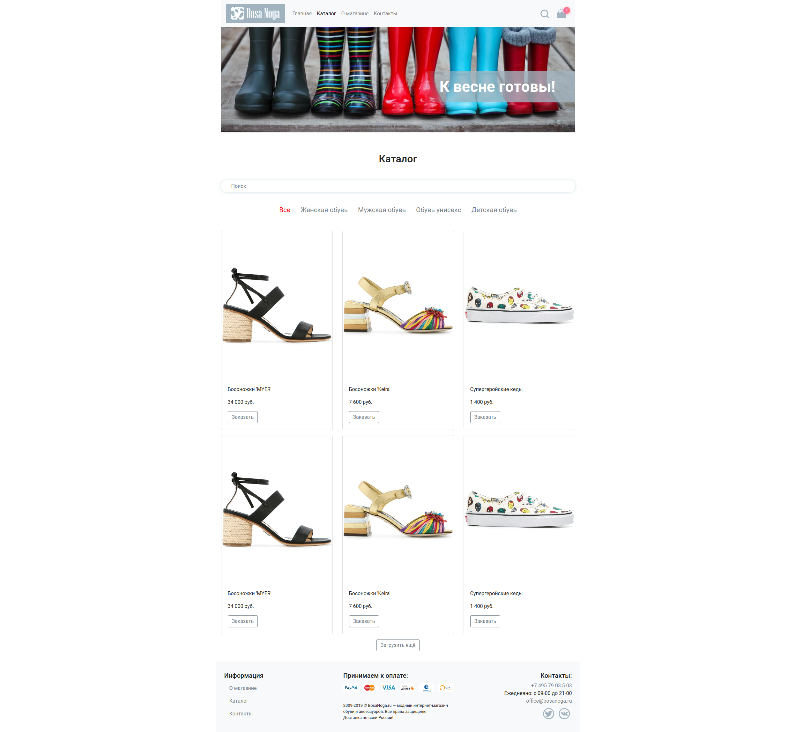

Фактически, он полностью повторяет функциональность каталога на главной странице, за одним исключением: у него есть поле поиска.

При заполнении этого поля отправляется запрос вида: GET http://localhost:7070/api/items?q=<текст в строке поиска>. При этом все правила относительно категории, кнопки "Загрузить ещё" сохраняются.

Если категория меняется, то данные перезагружаются с учётом строки поиска.

Строка поиска реагирует только на полный ввод (не live-поиск).

### Поиск

На всех страницах в шапке присутствует виджет поиска:


По умолчанию поисковое поле скрыто, отображается только иконка:

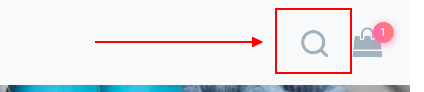

Эта иконка должна работать следующим образом: при первом клике открывает строку поиска, при втором - если был введён какой-то текст, то перенаправляет пользователя на страницу каталога (/catalog.html), при этом в поисковом поле должен быть отображён тот же текст, что был ввёден в строку поиска в шапке (и загрузка данных должна происходить исходя из этого):

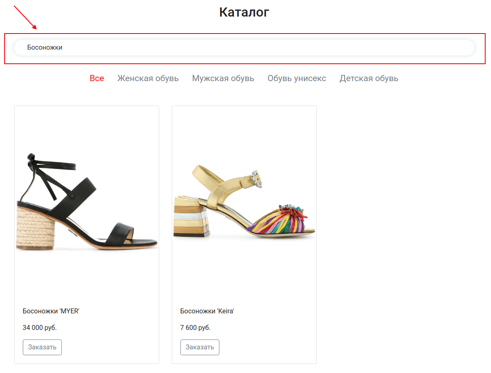

Поиск на сервере работает по точному совпадению цвета (без учёта регистра, например "черный") и по содержанию слова для названия (без учёта регистра, например можно найти "жар" в "Туфли Жар-птицы").

Если пользователь не ввёл никакой текст, то строка поиска просто схлопывается обратно (как сейчас реализовано в html).

### О магазине, Контакты

Это просто контентные страницы, в которые жёстко зашит контент. Никакой логики (кроме работы виджета поиска и ссылок) там нет.

### Страница товара

Страница товара выглядит следующим образом:

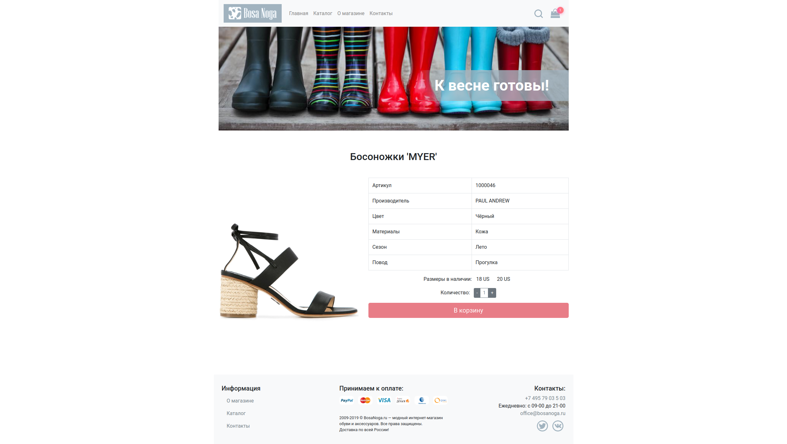

Страница открывается при нажатии кнопок "Заказать" в карточках товаров. URL - /catalog/:id.html. Где id - это id товара.

На ней интерес представляет только блок самого товара:

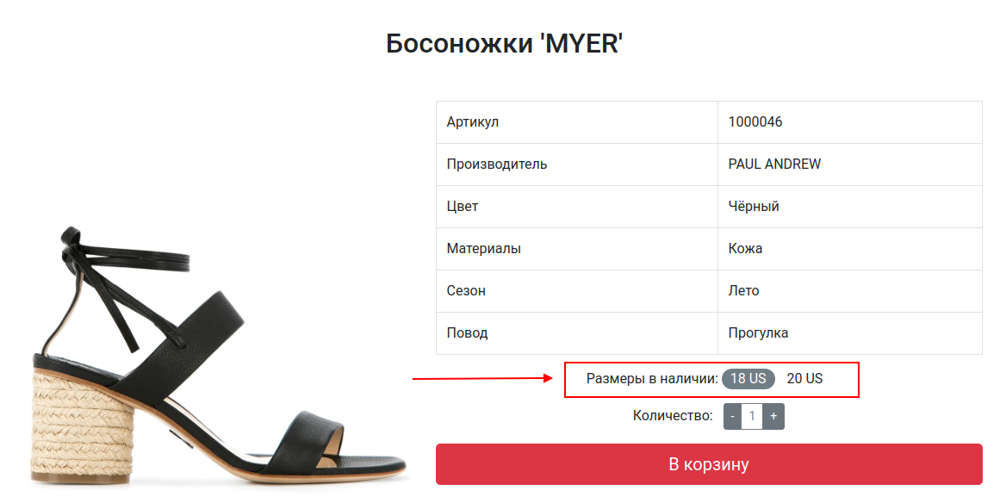

Ключевые моменты:
1. При загрузке показывается лоадер
1. Для загрузки полной информации о товаре нужно сделать GET http://localhost:7070/api/items/:id, где id - это id товара
1. Слева выводится картинка (в ответе может быть несколько картинок - вы берёте первую)
1. Сбоку выводится табличка с данными (все необходимые данные перечислены). Других - не нужно. Если каких-то в приходящем товаре не будет, то просто оставляете поле пустым.
1. Размеры - выводятся все доступные размеры (у которых флаг `available` равен `true`). По умолчанию ни один размер не выбран. После выбора он становится выделенным, как на скриншоте. Важно: кнопка "В корзину" активируется только тогда, когда есть размеры в наличии и выбран конкретный размер. Размер можно выбрать только один.
1. Количество - от 1 до 10.

Особые случаи: если ни одного размера не доступно, блок Количество и кнопка "В корзину" не отображаются.

После нажатия на кнопку "В корзину" пользователь перемещается в страницу корзины /cart.html.

### Страница корзины

В корзину можно попасть либо заказав что-то, либо кликнув на иконку корзины в шапке сайта.

Корзина выглядит следующим образом:

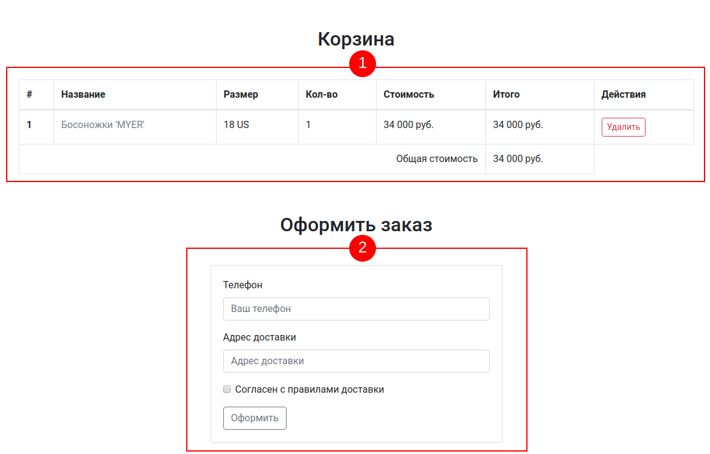

Блок корзина - отображает товары, находящиеся в корзине. Все товары хранятся локально в localStorage. Товар можно удалить из корзины (тогда он должен удалиться и из localStorage тоже)

Одной позицией считается пара - Товар + Размер. Т.е. если купить те же босоножки другого размера, то это будет две позиции в корзине. А если два раза купить босоножки того же размера - то изменится количество и общая стоимость (но запись останется в табличке одна).

Важно: стоимость должна фиксироваться при покупке - т.е. вы кладёте в localStorage именно ту стоимость за единицу, которая была в тот момент, когда пользователь нажал "В корзину".

Общая сумма расчитывается на базе суммирования всех позиций при отображении.

Соответственно, виджет корзинки отображает количество позиций в корзине:

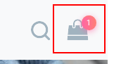

Если в корзине товаров нет вообще, то розового индикатора с числом тоже быть не должно.

Блок оформления заказа позволяет оформить заказ - POST http://localhost:7070/api/order

В теле - JSON:
```json
{
  "owner": {
    "phone": "+7xxxxxxxxxxx",
    "address": "Moscow City",
  },
  "items": [
    {
      "id": 1,
      "price": 34000,
      "count": 1
    }
  ]
}
```

После успешного оформления заказа все данные корзины должны быть вычищены из state и из localStorage.

Не забудьте показать пользователю loader и сообщение об успехе.

### 404

При вводе несуществующего url'а (не соответствующего ни одному из путей), пользователю должна показываться страница 404.html.

Дополнительно (но не обязательно), вы можете обрабатывать ошибку 404 при просмотре деталей товара (т.е. сервер вернул вам ответ с кодом 404).

## Profi Level

Подумайте над следующими моментами:
1. Как обрабатывать ситуацию, при которой пользователь покупал товар по одной цене, а когда решил купить, выяснилось, что цена поменялась?
1. Как можно безопасно сохранить данные телефона и доставки?
1. Как бороться с тем, что приходящие картинки не одинаковые по размеру?
1. Что показывать пользователю, если поиск не дал результатов?
1. Каким образом отображать сообщения об ошибке, чтобы либо автоматически, либо с помощью пользователя чуть позже повторно выполнить запрос (без полной перезагрузки страницы)?

## Как правильно работать над дипломом?

Что следует делать, чтобы все получилось: 
1. Попробовать найти ответ сначала самому в интернете. Ведь, именно скилл поиска ответов пригодится вам на первой работе. И только после этого спрашивать дипломного руководителя.
1. В одном вопросе должна быть заложена одна проблема.
1. Как правильно оформлять вопросы:
    - публикуете самую последнюю версию вашего код на GitHub
    - включаете в репозитории Issues
    - заводите новое Issue, в котором пишете:
        - в чём проблема (в каком компоненте, что и когда не работает), например: в компоненте показа товара (`src/components/Item/Item.js`) при кликах на кнопках +/- не отрабатывает `setState`;
        - прикладываете скриншот (чтобы все понимали куда смотреть);
        - если в консоли браузера есть ошибки - не поленитесь скопировать их тоже (не отпринскринить, а скопировать - Ctrl + C, Ctrl + V)
        - как в гитхабе нормально оформлять ссылки на код написано вот тут: https://help.github.com/en/articles/creating-a-permanent-link-to-a-code-snippet. Обязательно прочитайте, прежде чем заводить Issue.
1. Начинать работу над дипломом как можно раньше! Чтобы было больше времени на правки. 
1. Делать диплом по частям, а не все сразу. Иначе, есть шанс, что нужно будет все переделывать :)  

Что следует делать, чтобы ничего не получилось: 
1. Никому ничего не говорить.
1. Писать вопросы вида “Ничего не работает. Не запускается. Всё сломалось.”
1. Присылать скриншоты (или ещё хуже - фотографии экрана), не показывая код.
1. Откладывать диплом на потом.
1. Ждать того, что оно "заработает само".
1. Ждать ответ на свой вопрос моментально. Дипломные руководители - работающие разработчики, которые занимаются кроме преподавания, своими проектами. Их время ограничено, поэтому постарайтесь задавать правильные вопросы, чтобы получать быстрые ответы! 
